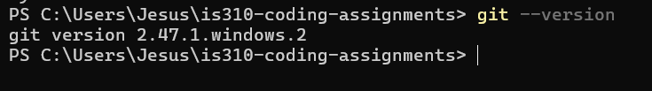
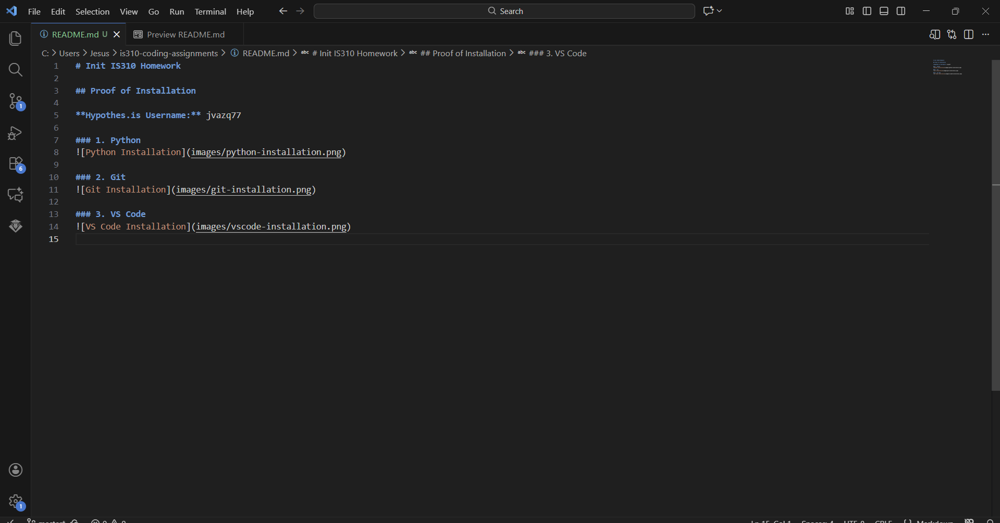

# Init IS310 Homework

## Proof of Installation

**Hypothes.is Username:** jvazq77

### 1. Python

### 2. Git

### 3. VS Code

### 4. AI Tool/Workflow

# I am planning on using mostly ChatGPT to brainstorm ideas and help manage errors in my code or stuff that i have not learned yet in python that I would like to add to my project. I did not use AI for this homework though